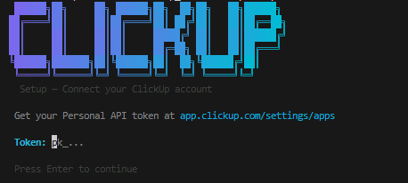

# ClickUp CLI

A fast, beautiful terminal UI for ClickUp. Browse tasks, filter by list or assignee, create tickets, update statuses, and post comments — all from the command line.



---

## Installation

**Prerequisite:** Node.js 18+

```bash
curl -fsSL https://raw.githubusercontent.com/hipsterreed/clickup-cli/main/install.sh | bash
```

That's it. The script clones the repo, installs dependencies, and adds `clickup` to your PATH. Re-running the command updates an existing installation.

### Manual install

```bash
git clone https://github.com/hipsterreed/clickup-cli
cd clickup-cli
npm install --omit=dev --legacy-peer-deps
npm link
```

---

## Setup

Get your Personal API token from **ClickUp → Settings → Apps → API Token**.

```bash
clickup setup
```

This launches a guided TUI wizard:
1. Paste your API token (input is masked)
2. Token is verified against the ClickUp API
3. Select your workspace from the list
4. Config is saved to your OS user config directory — **never** to the repository

**Non-interactive setup:**
```bash
clickup setup --token pk_abc123 --team 9012345678
```

---

## Commands

### `clickup` / `clickup tasks`

Opens the interactive TUI browser. Start here.

```
Browse Screen → pick a scope or list → split-pane task view
```

### `clickup tasks` (flag mode)

Non-interactive table output — scriptable and pipeable.

```bash
clickup tasks --me                              # my tasks
clickup tasks --me --status "in progress"       # filter by status
clickup tasks --list <list-id>                  # tasks in a specific list
clickup tasks --priority 1 --priority 2         # urgent + high priority
clickup tasks --include-closed                  # include done tasks
clickup tasks --subtasks                        # include subtasks
clickup tasks --desc                            # show descriptions
clickup tasks --order-by due_date               # sort by due date
clickup tasks --limit 20                        # cap results
```

Priority values: `1` = urgent, `2` = high, `3` = normal, `4` = low

### `clickup tasks view <task-id>`

Display full details of a single task.

```bash
clickup tasks view abc123def
clickup tasks view abc123def --comments         # include comment thread
```

### `clickup tasks status <task-id> <status>`

Change a task's status.

```bash
clickup tasks status abc123def "in review"
clickup tasks status abc123def "done"
```

Run without arguments to open the interactive TUI and pick from available statuses.

### `clickup tasks comment <task-id>`

Post a comment on a task.

```bash
clickup tasks comment abc123def -m "Looks good, merging now."
```

Run without `-m` to open the interactive TUI comment input.

### `clickup tasks create`

Create a new task in a list.

```bash
# Interactive TUI form
clickup tasks create --list <list-id>

# Non-interactive
clickup tasks create --list <list-id> --name "Fix login redirect"
clickup tasks create --list <list-id> --name "API rate limiting" \
  --desc "Add rate limiting to the public API endpoints" \
  --priority 2 \
  --status "to do" \
  --due 2026-04-20
```

### `clickup whoami`

Show the currently authenticated user and workspace.

```bash
clickup whoami
```

### `clickup logout`

Remove stored credentials.

```bash
clickup logout
```

### `clickup help`

Show a full command and keybinding reference.

```bash
clickup help
```

---

## TUI Navigation

### Browse Screen (initial)

Shown when you run `clickup` or `clickup tasks` with no flags.

| Key | Action |
|-----|--------|
| `↑` `↓` | Navigate scopes and lists |
| `enter` | Open selected scope/list |
| `q` | Quit |

Lists load in the background while you can already select **My Tasks** or **All Team Tasks**.

### Split Pane (task list + detail)

The main view: task list on the left, live task detail on the right.

| Key | Action |
|-----|--------|
| `↑` `↓` | Navigate tasks (detail updates instantly) |
| `enter` | Expand to full-screen detail (loads comments) |
| `n` | Create new task *(list context only)* |
| `s` | Change status of selected task |
| `c` | Add comment to selected task |
| `f` | Open filter panel |
| `r` | Refresh task list |
| `b` / `esc` | Back to browse screen |
| `?` / `h` | Keyboard reference overlay |
| `q` | Quit |

> **`n` (new task)** is only available when you've browsed into a specific list. The title bar shows `n:new` to confirm it's available.

### Full-Screen Task View

Expanded view with full description and comment thread.

| Key | Action |
|-----|--------|
| `s` | Change status |
| `c` | Add comment |
| `esc` / `b` | Back to split pane |
| `q` | Quit |

### Filter Panel (`f`)

| Key | Action |
|-----|--------|
| `↑` `↓` | Navigate between filter fields |
| `space` / `enter` | Toggle checkbox or cycle option |
| `←` `→` | Cycle scope / list selection |
| `enter` on `[Apply]` | Apply filters and reload |
| `esc` | Cancel without changing filters |

### Create Task Form (`n`)

| Key | Action |
|-----|--------|
| `↑` `↓` | Move between fields |
| `enter` | Edit text field / confirm |
| `←` `→` | Cycle priority or status options |
| `enter` on `[Create Task]` | Submit |
| `esc` | Cancel |

### Status Picker (`s`)

| Key | Action |
|-----|--------|
| `↑` `↓` | Navigate available statuses |
| `enter` | Confirm selected status |
| `esc` | Cancel |

### Comment Input (`c`)

| Key | Action |
|-----|--------|
| `enter` | Preview comment |
| `p` | Post (in preview mode) |
| `e` | Edit (in preview mode) |
| `esc` | Cancel |

---

## Security

**Your API token is never stored in this repository.**

- Config (token, team ID, user ID) is stored by the [`conf`](https://github.com/sindresorhus/conf) library in your OS user config directory:
  - **Windows:** `%APPDATA%\clickup-cli\config.json`
  - **macOS:** `~/Library/Preferences/clickup-cli/config.json`
  - **Linux:** `~/.config/clickup-cli/config.json`
- The config directory is outside the project — it is not tracked by git and is never included in commits.
- The `.gitignore` excludes `dist/`, `node_modules/`, `.env`, and any local config files.
- The API token is sent only as an HTTP `Authorization` header to `api.clickup.com`. It is never logged or printed.
- To revoke access, run `clickup logout` to clear local credentials, then rotate your token in ClickUp Settings → Apps.

---

## Development

```bash
npm run dev -- tasks           # run TUI without building
npm run dev -- setup           # test setup wizard
npm run dev -- tasks --me      # test flag mode
npm run build                  # compile TypeScript → dist/
npm link                       # install `clickup` globally from dist/
```

**Project structure:**

```
bin/clickup.ts          Entry point — Commander CLI wiring
src/
  api/                  ClickUp API modules (axios)
  apps/                 Top-level Ink app screens
    SetupApp.tsx        Setup wizard
    TasksApp.tsx        Main TUI (browse + split pane + overlays)
    QuickApp.tsx        Non-interactive flag-mode output
  config/config.ts      conf-backed credential storage
  types/clickup.ts      TypeScript interfaces
  ui/                   Ink components
    BrowseScreen.tsx    Initial scope/list picker
    TaskTable.tsx       Scrollable task list (left pane)
    TaskDetail.tsx      Task detail view (right pane / fullscreen)
    CreateTaskForm.tsx  New task form
    FilterPanel.tsx     Filter overlay
    StatusPicker.tsx    Status change overlay
    CommentInput.tsx    Comment input overlay
    CommentThread.tsx   Comment list
    HelpScreen.tsx      Keyboard reference overlay
    Header.tsx          Animated gradient ASCII header
    Spinner.tsx         Animated spinner
  utils/
    errors.ts           API error → user-friendly messages
    format.ts           Date, truncation, priority helpers
    guards.ts           requireConfig() guard
```

---

## ClickUp API

This tool uses the [ClickUp API v2](https://clickup.com/api). Endpoints used:

| Feature | Endpoint |
|---------|----------|
| Validate token | `GET /api/v2/user` |
| List workspaces | `GET /api/v2/team` |
| List spaces | `GET /api/v2/team/{teamId}/space` |
| List folders | `GET /api/v2/space/{spaceId}/folder` |
| List lists | `GET /api/v2/space/{spaceId}/list` |
| Fetch tasks | `GET /api/v2/team/{teamId}/task` |
| Fetch list tasks | `GET /api/v2/list/{listId}/task` |
| Get task | `GET /api/v2/task/{taskId}` |
| Create task | `POST /api/v2/list/{listId}/task` |
| Update task | `PUT /api/v2/task/{taskId}` |
| Get comments | `GET /api/v2/task/{taskId}/comment` |
| Post comment | `POST /api/v2/task/{taskId}/comment` |
